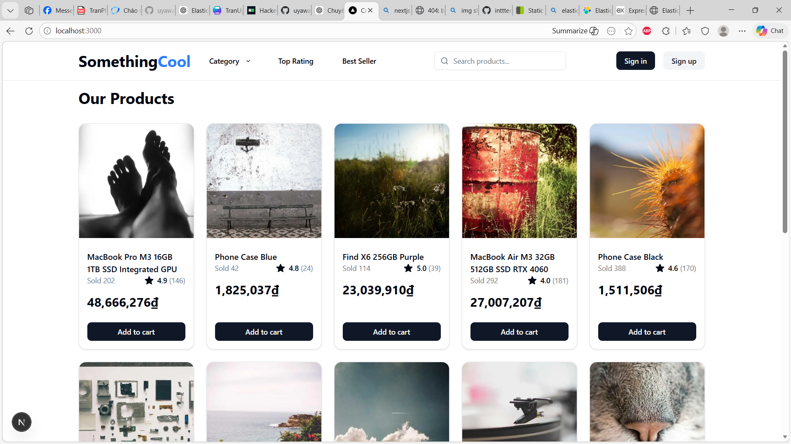
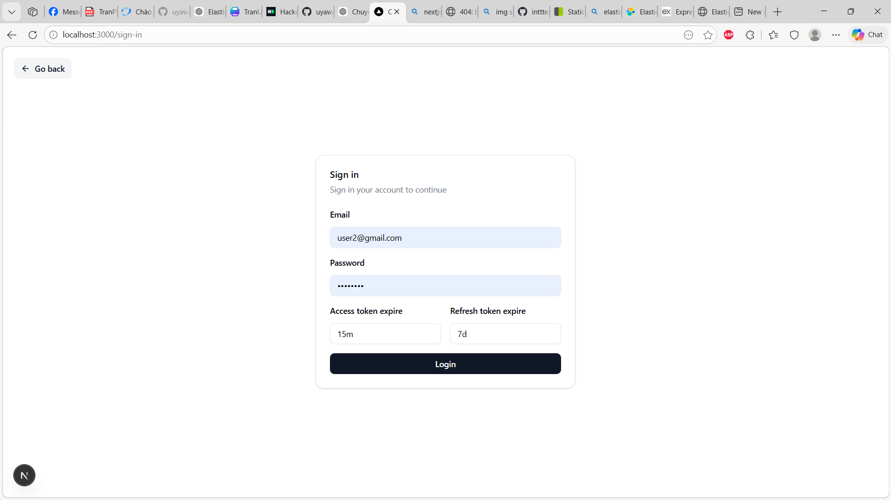
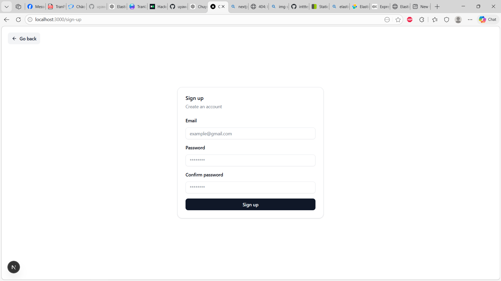
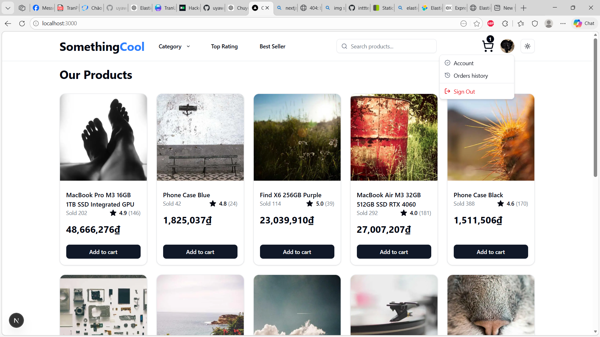
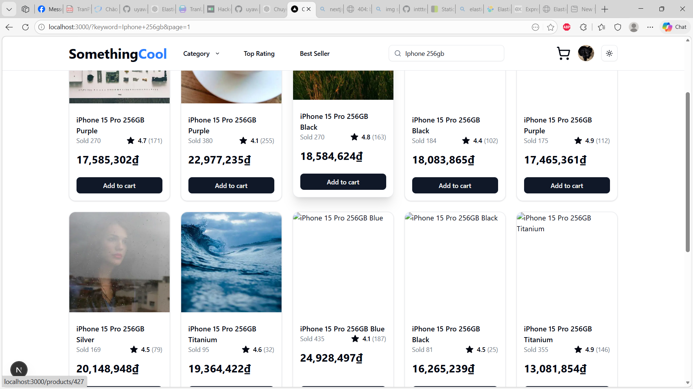
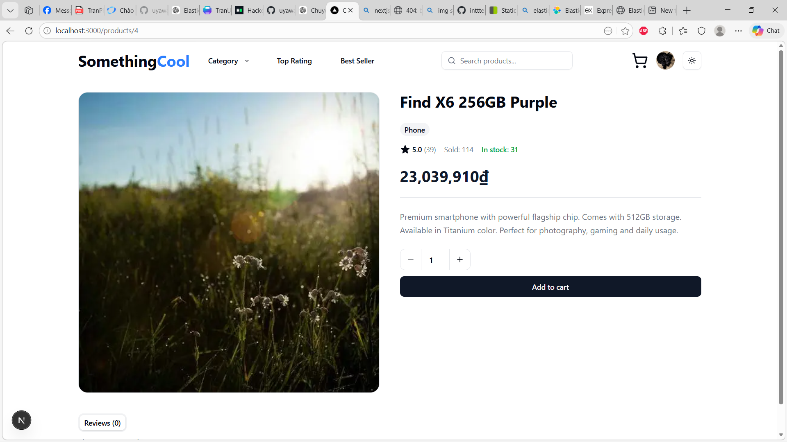
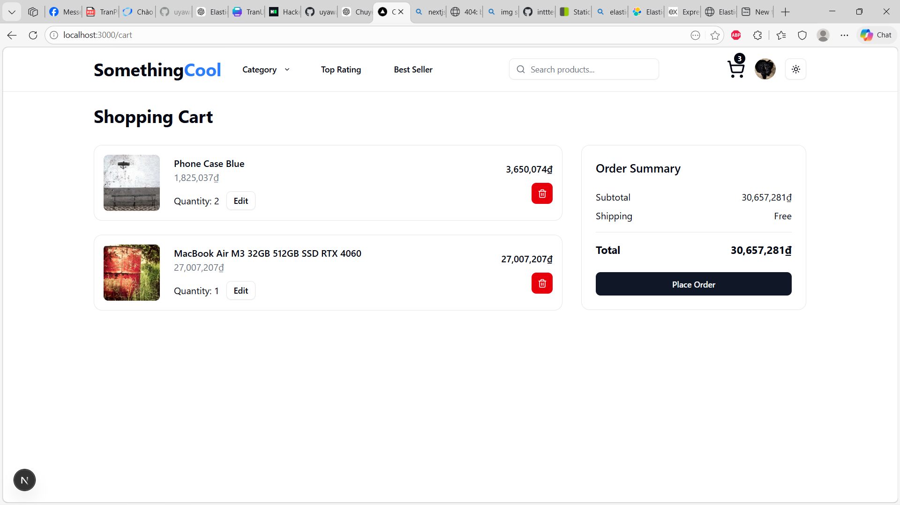
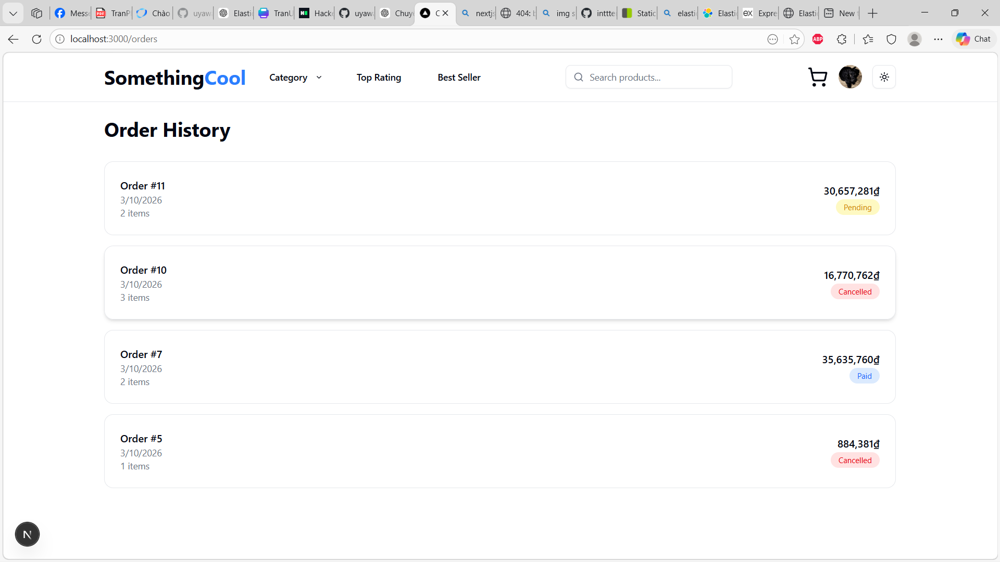
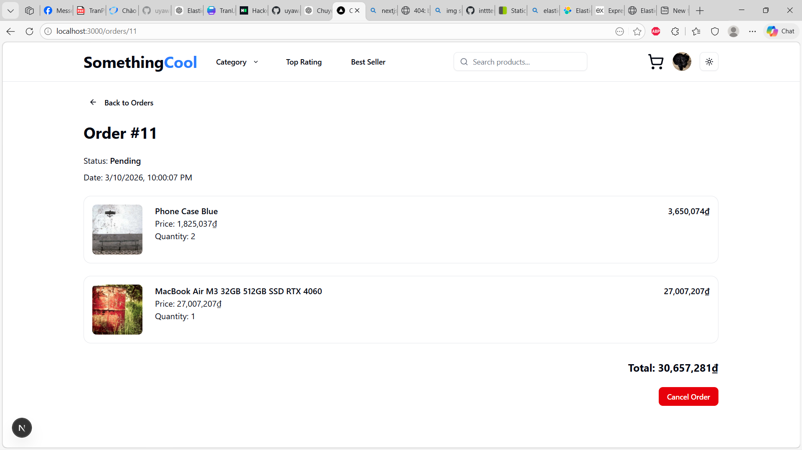

# 🛒 E-Commerce Fullstack Website
[](#) [](#) [](#) [](#)  [](#)  [](#) [](#)  

## 📌 Introduction

This project is a fullstack e-commerce platform built with modern web technologies.
The system supports product browsing, searching, and filtering with optimized performance using caching and a dedicated search engine.

The application follows a containerized microservice-style architecture where all services are managed using Docker Compose, making the project easy to deploy and run in a consistent environment.

### ⚡ Key features include:

- ✨ Product listing with pagination and filtering
- 🔎 Full-text product search
- 🚀 High-performance caching layer
- 📦 RESTful backend API
- 🐳 Containerized deployment

The search functionality is optimized using **Elasticsearch** and API performance is improved with **caching** using Redis.
Load testing was conducted using **k6**, improving search throughput from **18 req/s to over 300 req/s**.

## 🧰 Tech Stack
### 🎨 Frontend

- Next.js, React, TypeScript, Shadcn UI

### ⚙️ Backend

- Node.js, Express.js, Prisma

### 🗄 Databases

- PostgreSQL, Redis, Elasticsearch

### 🐳 DevOps

- Docker


## 🐳 Docker Setup

The entire system runs using Docker containers.

### 1️⃣ Clone repository
```bash
git clone https://github.com/uyaware/E-Commerce-Website
cd ecommerce
```

### 2️⃣ Build and start services
```bash
docker compose up -d --build
```

This command will start:
- PostgreSQL database
- Redis cache
- Elasticsearch search engine
- Backend API server
- Frontend application

### 3️⃣ Run database migration

After the backend container starts, run database migration using Prisma:
```bash
docker exec -it ecommerce_backend npx prisma migrate dev
```

### 4️⃣ Access the application

Frontend:
```
http://localhost:3000
```

Backend API:
```
http://localhost:8000
```
Elasticsearch:
```
http://localhost:9200
```
### 5️⃣ Stop containers
```bash
docker compose down
```
If you want to reset the database:

```bash
docker compose down -v
```
## 📸 Demo screenshots
#### Homepage for guests


#### Login


#### Register


#### Homepage after logged in


#### Search for "iphone 256gb"


#### Product detail


#### Cart


#### Order history


#### Order detail
